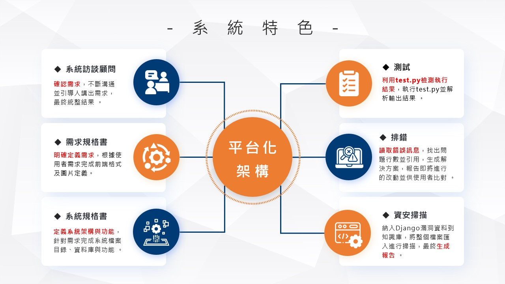

# 《CodeWeaver》：AI系統紡織機

隨著AI技術當紅，LLM輔助程式開發進入務實階段，當AI的輔助變成常態，我們是否能夠跳脫以人為錯誤防範為核心的系統開發流程？

此研究專注於訓練多個AI來替代軟體開發中需要人為的步驟，並且嘗試建立新的開發流程，大幅縮短開發所需時間與無法確定需求的風險。


## 設計架構圖




## Team
> 資管四甲  
> 指導教授：皮世明 老師
- 10944134 陳澔恩
- 10944105 侯文家
- 10944108 宋雨蕎
- 10944129 黃昱睿
- 10944121 劉建昱
- 10944144 王永宗

## Awards
- 中原資管系 畢業專題競賽 冠軍
- 第28屆大專校院資訊應用服務創新競賽 AI應用組 入圍決賽
- 第28屆大專校院資訊應用服務創新競賽 敏捷開發組 入圍決賽
- 2023 桃園新創之星 X 創天下競賽 入圍決賽
- 第五屆人工智慧與大數據創意競賽 入圍決賽

## Deployment

創建.env檔案輸入key，可參考.env.example檔案
```env
DJANGO_SECRET_KEY='django-insecure-^2^0qd(@mq-p03et2tp)6qyh(qj6-$i!mdka$dpi5x*$**f#36'
DJANGO_DEBUG=True

# 官方的key
OPENAI_API_KEY=sk-*************
```

[0.0.0.0:8000/webpages/test_index](http://0.0.0.0:8000/webpages/test_index) - 測試圖片庫讀取 和 OpenAI API key讀取

[0.0.0.0:8000/gpt_handler](http://0.0.0.0:8000/gpt_handler) - 測試OpenAI API
